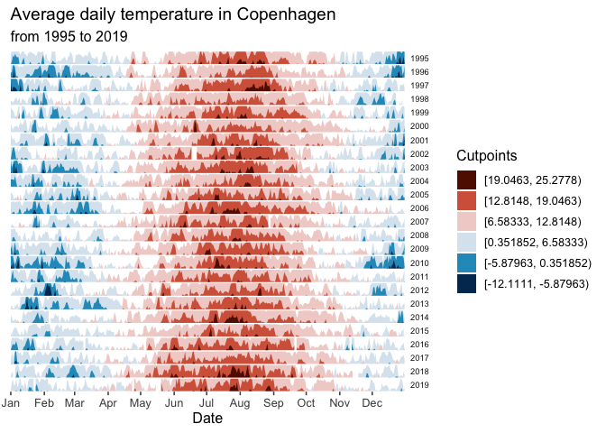

# ggHoriPlot: build horizon plots in ggplot2 

<!-- badges: start -->

[](https://github.com/rivasiker/ggHoriPlot/actions/workflows/check-standard.yaml)
[](https://cran.r-project.org/web/packages/ggHoriPlot/index.html)
[](https://cran.r-project.org/web/packages/ggHoriPlot/index.html)
[](https://codecov.io/gh/rivasiker/ggHoriPlot)
<!-- badges: end -->

This package allows building horizon plots in ggplot2. You can learn
more about the package in `vignette("ggHoriPlot")`.

## Installation

You can install `ggHoriPlot` from CRAN via:

``` r
install.packages("ggHoriPlot")
```

You can also install the development version of the package from GitHub
with the following command:

``` r
#install.packages("devtools")
devtools::install_github("rivasiker/ggHoriPlot")
```

## Basic example

Load the libraries:

``` r
library(tidyverse)
library(ggHoriPlot) 
library(ggthemes)
```

Load the dataset and calculate the cutpoints and origin:

``` r
utils::data(climate_CPH)

cutpoints <- climate_CPH  %>% 
  mutate(
    outlier = between(
      AvgTemperature, 
      quantile(AvgTemperature, 0.25, na.rm=T)-
        1.5*IQR(AvgTemperature, na.rm=T),
      quantile(AvgTemperature, 0.75, na.rm=T)+
        1.5*IQR(AvgTemperature, na.rm=T))) %>% 
  filter(outlier)

ori <- sum(range(cutpoints$AvgTemperature))/2
sca <- seq(range(cutpoints$AvgTemperature)[1], 
           range(cutpoints$AvgTemperature)[2], 
           length.out = 7)[-4]

round(ori, 2) # The origin
#> [1] 6.58

round(sca, 2) # The horizon scale cutpoints
#> [1] -12.11  -5.88   0.35  12.81  19.05  25.28
```

Build the horizon plots in `ggplot2` using `geom_horizon()`:

``` r
climate_CPH %>% ggplot() +
  geom_horizon(aes(date_mine, 
                   AvgTemperature,
                   fill = ..Cutpoints..), 
               origin = ori, horizonscale = sca) +
  scale_fill_hcl(palette = 'RdBu', reverse = T) +
  facet_grid(Year~.) +
  theme_few() +
  theme(
    panel.spacing.y=unit(0, "lines"),
    strip.text.y = element_text(size = 7, angle = 0, hjust = 0),
    axis.text.y = element_blank(),
    axis.title.y = element_blank(),
    axis.ticks.y = element_blank(),
    panel.border = element_blank()
    ) +
  scale_x_date(expand=c(0,0), 
               date_breaks = "1 month", 
               date_labels = "%b") +
  xlab('Date') +
  ggtitle('Average daily temperature in Copenhagen', 
          'from 1995 to 2019')
```

<!-- -->

## Learn more

You can check out the full functionality of `ggHoriPlot` in the
following guides:

-   [Getting
    started](https://rivasiker.github.io/ggHoriPlot/articles/ggHoriPlot.html)
-   [Examples with real
    data](https://rivasiker.github.io/ggHoriPlot/articles/examples.html)
